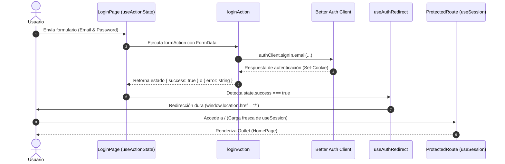

# Frontend - Auth App con React 19

Aplicación frontend moderna de autenticación construida con **React 19**, **Vite**, **TypeScript**, **Tailwind CSS v4** y **Better Auth**, estructurada bajo los principios de **Pragmatic Clean Architecture** (Feature-Driven / Vertical Slice).

---

## 🚀 Tech Stack

- **Framework**: [React 19](https://react.dev/) (utilizando `useActionState`, Actions y React Compiler).
- **Build Tool**: [Vite](https://vite.dev/) con alias de módulos (`@/*` apuntando a `src/*`).
- **Lenguaje**: [TypeScript](https://www.typescriptlang.org/) con verificación estricta.
- **Autenticación**: [Better Auth](https://www.better-auth.com/) (`better-auth/react`).
- **Enrutamiento**: [React Router DOM v7](https://reactrouter.com/).
- **Estilos**: [Tailwind CSS v4](https://tailwindcss.com/) con `@tailwindcss/vite`.
- **Compilador**: React Compiler habilitado con `@rolldown/plugin-babel` para memoización automática.

---

## 🏛️ Arquitectura: Pragmatic Clean Architecture (Feature-Driven)

En lugar de aplicar una Clean Architecture académica rígida (que obligaría a crear capas ceremoniales de *Repositories*, *Use Cases*, *Entities* e *Interfaces* para pantallas sencillas), este proyecto implementa **Pragmatic Clean Architecture** (también conocida como *Vertical Slice Architecture* o *Feature-Sliced Design*).

Esto otorga el **80% de los beneficios de Clean Architecture con el 20% de su complejidad**.

### Estructura de Directorios

```
client/src/
├── app/                          # Capa global de aplicación / Shell
│   ├── App.tsx                   # Componente raíz con Router
│   ├── AppRoutes.tsx             # Definición y orquestación de rutas
│   └── ProtectedRoute.tsx        # Guard para control de acceso y sesión
│
├── features/                     # Slices verticales por dominio de negocio
│   ├── auth/                     # Dominio de autenticación y perfil
│   │   ├── actions/              # Lógica de mutación/actions (login, register, logout)
│   │   ├── components/           # Componentes exclusivos de la feature (PasswordValidator)
│   │   ├── hooks/                # Custom hooks de la feature (useAuthRedirect)
│   │   ├── lib/                  # Instancia y configuración del cliente (auth-client)
│   │   └── pages/                # Vistas principales (LoginPage, RegisterPage, ProfilePage)
│   │
│   └── home/                     # Dominio de la página principal / dashboard
│       └── pages/
│           └── HomePage.tsx      # Vista del dashboard autenticado
│
├── shared/                       # Código común y reutilizable en toda la app
│   └── components/
│       └── Navbar.tsx            # Componentes de UI compartidos
│
├── main.tsx                      # Punto de entrada de la aplicación
└── index.css                     # Estilos globales y tokens de Tailwind CSS v4
```

### Principios SOLID y Buenas Prácticas Aplicadas

1. **Responsabilidad Única (SRP)**:
   - **Vistas/Páginas** (`LoginPage.tsx`, `RegisterPage.tsx`): Se limitan a la presentación y binding de formularios.
   - **Acciones** (`login.action.ts`, `register.action.ts`): Funciones asíncronas puras encargadas de procesar el `FormData`, comunicarse con el backend y retornar estados tipados (`AuthActionState`).
   - **Componentes especializados** (`PasswordValidator.tsx`): Aislados para encargarse únicamente del feedback visual de requisitos de contraseñas.
   - **Efectos colaterales** (`useAuthRedirect.ts`): Hook reutilizable que desacopla la lógica de redirección post-éxito de la UI.

2. **Inversión de Dependencias (DIP) Ligera**:
   - La UI no conoce los detalles de bajo nivel de transporte o endpoints; consume acciones que retornan contratos de estado predecibles `{ success, error }`.
   - Se evita el exceso de boilerplate de clases abstractas o interfaces innecesarias.

3. **Alta Cohesión y Bajo Acoplamiento**:
   - Todo lo que necesita la feature `auth` (acciones, páginas, hooks, validadores) vive dentro de su propia carpeta.

4. **Sin Barrel Files (Direct Imports)**:
   - Los imports se hacen de manera explícita y directa (ej. `import { loginAction } from "@/features/auth/actions/login.action"`), evitando ciclos de dependencia circulares y optimizando el *tree-shaking* del bundler.

---

## 🔐 Flujo y Mecánica de Autenticación

El sistema de autenticación aprovecha las nuevas APIs de **React 19** y **Better Auth**:



### 1. Manejo de Formularios con React 19 Form Actions
- Se utiliza el hook `useActionState` para conectar el formulario directamente con las acciones (`loginAction`, `registerAction`).
- No requiere estados locales redundantes para `isLoading` o `error`; React 19 gestiona `isPending` y el estado de retorno de la acción automáticamente.

### 2. Sincronización de Sesión y Redirección (`useAuthRedirect`)
- **Problema resuelto**: Las funciones `signIn` y `signUp` establecen la cookie de sesión en el servidor, pero el caché en memoria del hook `useSession` no se invalida inmediatamente si se hace una navegación cliente simple (`navigate("/")`), lo que causaba que `ProtectedRoute` expulsara al usuario de vuelta a `/login`.
- **Solución**: El hook `useAuthRedirect` ejecuta una navegación dura (`window.location.href = "/"`). Al recargar la aplicación, `useSession` hidrata el estado fresco desde el servidor, validando la cookie de inmediato.

### 3. Progressive Disclosure y Validación de Contraseñas
- **Validación nativa en cliente**: En `RegisterPage`, el atributo HTML5 `pattern` pre-valida el formato antes del submit para feedback instantáneo sin latencia de red.
- **Validación Progresiva (`PasswordValidator.tsx`)**: Muestra en tiempo real qué reglas se van cumpliendo (longitud mínima de 8 caracteres, mayúsculas, símbolos especiales `!@#$&*`) sólo cuando el usuario hace foco en el campo, mejorando la experiencia de usuario.

### 4. Rutas Protegidas (`ProtectedRoute.tsx`)
- Envuelve las rutas autenticadas (`/`, `/profile`) en `AppRoutes.tsx`.
- Maneja el estado de carga (`isPending`), redirige con `<Navigate to="/login" replace />` si no existe sesión activa, y renderiza `<Outlet />` si la sesión es válida.

---

## 🔍 Configuración de ESLint & Type-Aware Rules

El proyecto utiliza el nuevo sistema **Flat Config** de ESLint 9 (`eslint.config.js`).

### Configuración Actual
```javascript
export default defineConfig([
  globalIgnores(['dist']),
  js.configs.recommended,
  ...tseslint.configs.recommended,
  reactHooks.configs.flat.recommended,
  reactRefresh.configs.vite,
  {
    files: ['**/*.{ts,tsx}'],
    languageOptions: {
      globals: globals.browser,
    },
  },
])
```
- **Rendimiento**: Análisis sintáctico ultra rápido en tiempo de desarrollo y ejecución de `npm run lint`.
- **Seguridad**: El script `npm run build` corre `tsc -b && vite build`, garantizando que el compilador de TypeScript valide la integridad de todos los tipos antes de compilar.

### ¿Cuándo activar Type-Aware Linting (`recommendedTypeChecked`)?
El template incluye la opción de habilitar reglas basadas en el sistema de tipos:
- **Ventajas**: Detecta promesas no manejadas (olvido de `await` en llamadas asíncronas), condiciones booleanas redundantes sobre tipos estrictos y filtración de `any`.
- **Trade-off**: Incrementa el tiempo de ejecución de ESLint en cada guardado/lint, ya que debe generar el AST de tipos completo de TypeScript.
- **Recomendación**: La configuración actual es la ideal para desarrollo ágil; habilita `recommendedTypeChecked` si el proyecto pasa a una etapa enterprise con políticas estrictas de CI/CD.

---

## ⚡ React Compiler & Optimización

- La aplicación tiene habilitado el **React Compiler** mediante `@rolldown/plugin-babel` y `@vitejs/plugin-react` (`reactCompilerPreset`).
- **Beneficio**: Optimiza automáticamente el renderizado y la memoización de componentes y hooks, eliminando la necesidad de escribir manualmente `useMemo` y `useCallback`.

---

## 🛠️ Scripts Disponibles

```bash
# Iniciar servidor de desarrollo local
npm run dev

# Validar tipos con TypeScript y generar bundle de producción
npm run build

# Ejecutar análisis estático de código con ESLint
npm run lint

# Previsualizar el build de producción localmente
npm run preview
```

---

## 🌐 Despliegue en Producción (Vercel) & Arquitectura de Red

### 1. Solución al error 404 en recarga (`F5` o acceso directo a rutas)

Al ser una aplicación **SPA (Single Page Application)** gestionada por React Router en el navegador, las rutas como `/login` o `/profile` existen únicamente a nivel de cliente. Si un usuario accede directamente a estas URLs o presiona `F5` para recargar, el servidor de Vercel intentará buscar un archivo físico estático en esa ruta (ej. `/login.html`), respondiendo con un error `404: NOT_FOUND`.

Para solucionar esto, se configuran reglas de reescritura (*rewrites*) en [vercel.json](file:///c:/Users/USUARIO/Desktop/Auth%20-%20React%2019%20+%20Node%20-%20sin%20comentarios/client/vercel.json).

### 2. Solución al Bloqueo de Cookies Cross-Origin (Vercel Reverse Proxy)

#### El Problema
Al desplegar el Frontend en **Vercel** (`auth-react-node-front.vercel.app`) y el Backend en **Render** (`auth-react-node-api.onrender.com`), ambos residen en dominios de sufijo público completamente distintos.
- Better Auth emite cookies de sesión con la directiva estándar `SameSite=Lax`.
- Los navegadores modernos (Chrome, Safari, Edge) bloquean o se niegan a enviar cookies `SameSite=Lax` en peticiones `fetch`/AJAX entre sitios diferentes (*Cross-Site*).
- Esto provocaba que tras iniciar sesión o verificar el correo, las llamadas a `/api/auth/get-session` no enviaran la cookie, expulsando al usuario inmediatamente de vuelta al `/login`.

#### La Solución: Reverse Proxy
En lugar de forzar cookies de terceros con `SameSite=None` (que suelen ser bloqueadas agresivamente por políticas de privacidad de navegadores como Safari ITP o Chrome Privacy Sandbox), se configuró **Vercel como Reverse Proxy**.

**Configuración en [vercel.json](file:///c:/Users/USUARIO/Desktop/Auth%20-%20React%2019%20+%20Node%20-%20sin%20comentarios/client/vercel.json):**
```json
{
  "rewrites": [
    {
      "source": "/api/:match*",
      "destination": "https://auth-react-node-api.onrender.com/api/:match*"
    },
    {
      "source": "/(.*)",
      "destination": "/index.html"
    }
  ]
}
```

**Configuración en [auth-client.ts](file:///c:/Users/USUARIO/Desktop/Auth%20-%20React%2019%20+%20Node%20-%20sin%20comentarios/client/src/features/auth/lib/auth-client.ts):**
```typescript
export const authClient = createAuthClient({
  baseURL: import.meta.env.PROD 
    ? window.location.origin 
    : (import.meta.env.VITE_API_URL || "http://localhost:3000"),
  plugins: [emailOTPClient()],
});
```

**Beneficios obtenidos:**
1. **Cookies First-Party**: Para el navegador, todas las peticiones ocurren dentro del mismo dominio (`auth-react-node-front.vercel.app`), aceptando las cookies de sesión `SameSite=Lax` de manera natural y segura.
2. **Cero fricción de CORS**: Al ser llamadas al mismo origen en producción, se evitan errores de preflight/CORS.
3. **Compatibilidad total**: Funciona de forma transparente en cualquier navegador y dispositivo sin requerir desactivar protecciones contra cookies de terceros.


